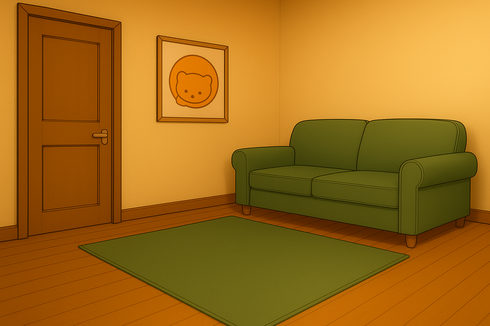
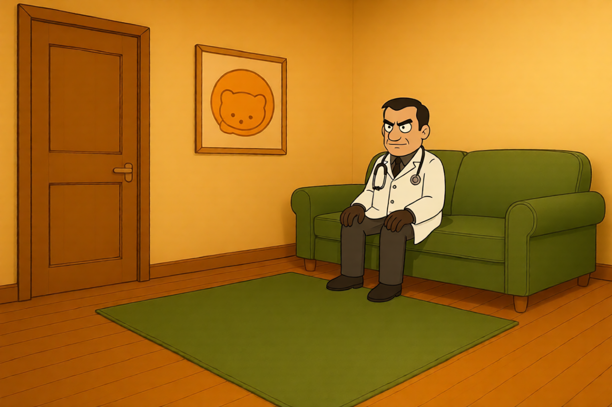
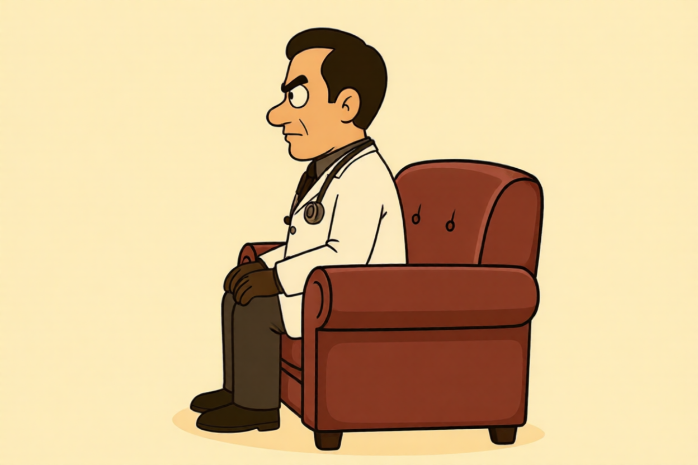
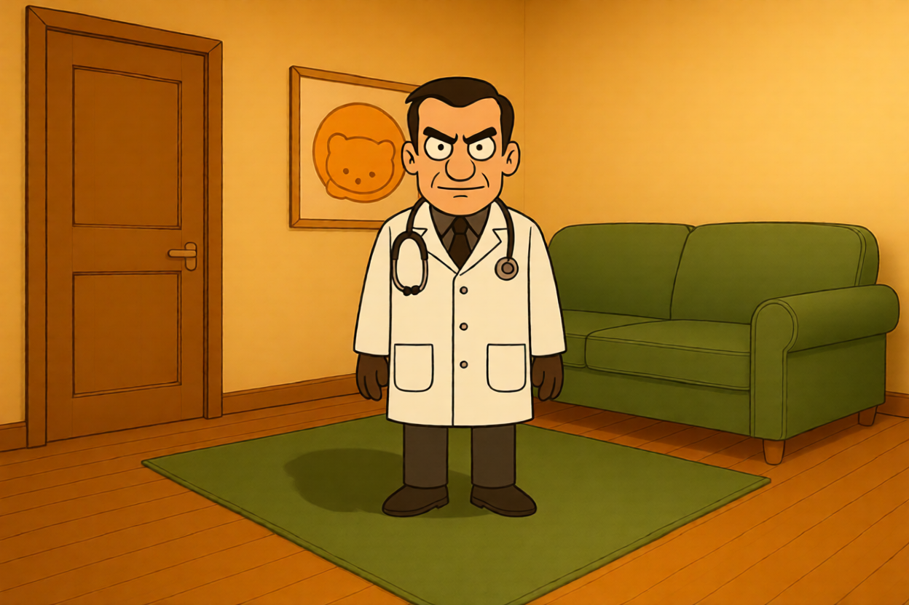

# Setup

## Index

- [Services](#services)
- [Scripts](#scripts)
- [Tests](#tests)
- [Demo](#demo)
  - [Ref-guided generation](#ref-guided-generation-eli-on-couch-with-backdrop)
  - [Character sheet creation](#character-sheet-creation-eli)
  - [VLM Analysis (Video & Image)](#vlm-analysis-video--image)
  - [Angle edit](#angle-edit)
  - [Image edit service](#image-edit-service-img_edit)

## Quickstart (recommended)

Run the repo setup script (creates `.venv`, installs requirements, downloads models, and starts ComfyUI in tmux):

```bash
./setup.sh
# Activate the venv created by setup.sh
source .venv/bin/activate
```

### Model downloads

- **ComfyUI workflow models**: downloaded by the setup script via `utils/load_comfy_models.py`.
- **Qwen Hugging Face weights** (downloading Qwen VL weights without vLLM which needs 580+ Nvidia driver): see `docs/download_hf_weights.md`.

Setup automatically downloads models; the links above are only needed if something errors.

## Services

Server call to ComfyUI via JSON workflows.

Requires a local ComfyUI server (default `http://127.0.0.1:8188`), started by setup script.

**Img-edit** (1–3 reference images):

```bash
python services/img_edit_service/img_edit.py \
  --images ./ref.png \
  --prompt "Add soft rim lighting; keep identity." \
  --output-dir output/img-edit
```

- `--images` — one to three reference image paths or `http://` / `https://` URLs (required).
- `--prompt` — edit instruction (required, non-empty).
- `--output-dir` — directory for PNG outputs (optional; default: `output/img-edit`).
- `--comfy-url` — ComfyUI base URL (optional; default: `http://127.0.0.1:8188`).

**Edit-angle** (single reference image):

```bash
python services/edit_angle_service/edit_angle.py \
  --image ./ref.png \
  --prompt "Low-angle wide shot, same subject and outfit." \
  --output-dir output/edit-angle
```

- `--image` — reference image path or `http://` / `https://` URL (required).
- `--prompt` — angle or framing instruction (required, non-empty).
- `--output-dir` — directory for PNG outputs (optional; default: `output/edit-angle`).
- `--comfy-url` — ComfyUI base URL (optional; default: `http://127.0.0.1:8188`).

## Scripts

### Qwen VL CLI (`run_qwen_vl.py`)

From the repo root, run the Qwen VL CLI (all flags):

```bash
python scripts/run_qwen_vl.py \
  --images <path-or-url> [<path-or-url> ...] \
  --video <video-path-or-url> \
  --prompt "<question or instruction>"
```

- `--images` — optional; one to three reference image file paths or `http://` / `https://` URLs when provided.
- `--video` — optional; one video local path or `http://` / `https://` URL. If the URL/path does not end in a supported video suffix (`.mp4`, `.mov`, `.mkv`, `.avi`, `.webm`, `.m4v`), the CLI will download/transcode it to MP4 first, which requires `ffmpeg` on `PATH`.
- At least one of `--images` or `--video` must be provided.
- `--prompt` — text prompt for evaluation (required, non-empty).

### Edit prompt enhancement CLI (`run_enhance_edit_prompt.py`)

From the repo root, run the edit-prompt enhancement CLI (all flags):

```bash
python scripts/run_enhance_edit_prompt.py \
  --images <path-or-url> [<path-or-url> ...] \
  --prompt "<edit instruction>"
```

- `--images` — required; one to three reference image file paths or `http://` / `https://` URLs.
- `--prompt` — required; raw edit instruction to enhance (non-empty).
- Prints a single enhanced prompt to stdout. The underlying model is asked to respond with JSON containing a `Rewritten` field.

### Character sheet creation CLI (`run_character_sheet_creation.py`)

#### Example: create a character sheet

```bash
python scripts/run_character_sheet_creation.py \
  --image ./ref.png \
  --character-name "Aria"
```

#### Example: also write a character description JSON

```bash
python scripts/run_character_sheet_creation.py \
  --image ./ref.png \
  --character-name "Aria" \
  --character-description
```

- `--image` — required; single reference image path or `http://` / `https://` URL.
- `--character-name` — required; used for default output dir and output filenames.
- `--output-dir` — optional; default: `storage/<character-name>`.
- `--comfy-url` — optional; default: `http://127.0.0.1:8188`.
- `--character-description` — optional; when set, writes a JSON file with a VLM-generated description.

Outputs:
- Always prints a single path to stdout:
  - Fullbody input → prints `<output_dir>/<character_name>_character_sheet.png` and exits 0.
  - Non-fullbody input → generates a corrected fullbody PNG, prints its path, prints error message to stderr, exits 1.
- When `--character-description` flag entered, also writes:
  - `<output_dir>/<character_name>_character_description.json`
  - JSON includes: `character_name`, `image_described`, `description`, and `character_sheet_path` (when a sheet exists).

### Ref guided generation CLI (`run_ref_guided_gen.py`)

Reference-guided Qwen image edit using `@CharacterName` tokens in the prompt.

How it works:
- Parses unique `@CharacterName` references in `--prompt` (left-to-right).
- Each `@CharacterName` maps to `storage/<CharacterName>/<safe(CharacterName)>_character_sheet.png`.
- Image slot ordering is deterministic:
  - Image 1..N: character sheets in parse order
  - Image N+1: `--backdrop-img` (optional) as scene/backdrop reference

Constraints:
- Supports up to **2 unique** `@CharacterName` references plus an optional backdrop (max **3** images total, matching `img_edit` due to ComfyUI constraint and can be improved via API or direct Qwen Img repo cloning).

Prerequisite:
- Create each character sheet first via `scripts/run_character_sheet_creation.py`.

Example:

```bash
python scripts/run_ref_guided_gen.py \
  --prompt "@Eli sitting on the couch, staring at @Beth's phone" \
  --backdrop-img <path-or-url> \
  --output-dir output/ref-guided-gen
```

Outputs:
- Prints one or more lines like `saved <path>` for generated PNGs.

# Tests

```bash
python -m pytest tests/ -q
```

## Demo

**Demo variables** (from `tests/test_commands.md` lines 11–16)

```powershell
$CAT_IMG="https://renderboard-test.s3.us-east-005.backblazeb2.com/images/base64-ea3a392a-23de-43c4-a915-83ebcc2a2725"
$VET_IMG="https://renderboard-test.s3.us-east-005.backblazeb2.com/images/base64-0c187082-bcd0-48b4-9fd6-9b8ca699b33a"
$GIRL_IMG="https://renderboard-test.s3.us-east-005.backblazeb2.com/images/base64-f38842e4-a365-479d-aa6c-c67e76ccc234"
$ROOM_IMG="https://renderboard-test.s3.us-east-005.backblazeb2.com/images/base64-6f9167f5-0d6e-4b2a-b02f-cebb165435a2"
$SCENE_VIDEO="https://renderboard-test.s3.us-east-005.backblazeb2.com/videos/asset-ee0e77cc-d735-4d35-bcbe-ef89eaa23789"
```

### Ref-guided generation: Eli on couch (with backdrop)

**Command**

```bash
python scripts/run_ref_guided_gen.py \
  --prompt "@Eli sitting on the couch" \
  --backdrop-img "$ROOM_IMG" \
  --output-dir output/ref-guided-gen
```

**Prompt**

`@Eli sitting on the couch`

**Input (scene/backdrop)**



**Output**



<details>
<summary>Key logs (click to expand)</summary>

```text
combined_prompt:
Character in image 1 sitting on the couch

Use image 2 as the scene/backdrop reference. Keep the appearance, clothing, and all details of each character the same as in the 1 image reference(s).
[comfy][info] ... (queue/history events)
saved /root/jadu_image_video_ai_demo/output/ref-guided-gen/ComfyUI_00006_.png
```

</details>

### Character sheet creation: Eli

**Command**

```bash
python scripts/run_character_sheet_creation.py --image $VET_IMG --character-name "Eli" --full-body-check
```

**Output**


<details>
<summary>Sample log (click to expand)</summary>

```text
=== args ===
image='https://renderboard-test.s3.us-east-005.backblazeb2.com/images/base64-0c187082-bcd0-48b4-9fd6-9b8ca699b33a'
character_name='Eli'
output_dir='storage/Eli'
comfy_url='http://127.0.0.1:8188'
full_body_check=True
character_description=False

=== step: full-body-check (QwenVL) ===
... (QwenVL output) ...
=== ok: step: character sheet creation elapsed_ms=... ===
/root/jadu_image_video_ai_demo/storage/Eli/Eli_character_sheet.png
```

</details>

### VLM analysis (video + image)

**Command**

```bash
python scripts/run_qwen_vl.py --images $ROOM_IMG --video $SCENE_VIDEO --prompt "Describe both the image and the video with as much detail as possible, then explain what visual details are consistent or different between them."
```

**Output**

The first image is a static, cartoon-style illustration of a cozy, warmly lit living room. The room features mustard-yellow walls, a wooden floor with visible planks, and a simple, olive-green sofa positioned against the right wall. A matching green rectangular rug lies in front of the sofa, and to the left, a wooden door with a silver handle is slightly ajar. Above the door, a framed picture hangs on the wall, depicting a stylized, smiling orange bear face against a light background. The scene is devoid of people and conveys a quiet, domestic atmosphere.

The second image is a dynamic, animated scene featuring a woman in a dark convertible car at night. She has short, dark hair, wears large black sunglasses, and is dressed in a black blazer with a red pendant necklace. Her expression is serious and focused as she grips the steering wheel. The car’s interior is dark, and the background is a blurred, dark expanse, suggesting motion and speed. The lighting is low, with subtle highlights on her face and the car’s interior, emphasizing a mysterious or intense mood.

The two images are visually distinct in several ways. The first is a static, warm, and tranquil interior scene, while the second is a dynamic, cool-toned scene focused on action and atmosphere.

<details>
<summary>Generation log (click to expand)</summary>

```text
.venv) root@5255d91fbdee:~/jadu_image_video_ai_demo# python scripts/run_qwen_vl.py --images $ROOM_IMG --video $SCENE_VIDEO --prompt "Describe both the image and the video with as much detail as possible, then explain what visual details are consistent or different between them."
2026-05-07 11:36:04,839 INFO qwen_vl - Loading Qwen3-VL processor: models/hf/Qwen__Qwen3-VL-4B-Instruct
2026-05-07 11:36:05,486 INFO qwen_vl - Loading Qwen3-VL model: models/hf/Qwen__Qwen3-VL-4B-Instruct (device=cuda:0, dtype=torch.bfloat16)
Loading checkpoint shards: 100%|████████████████| 2/2 [00:00<00:00, 25.00it/s]
2026-05-07 11:36:07,016 INFO qwen_vl - Qwen3-VL Transformers model is ready on cuda:0.
2026-05-07 11:36:08,401 INFO qwen_vl - Built Qwen3 messages with 1 image(s) and 1 video.
qwen-vl-utils using torchvision to read video.
2026-05-07 11:36:10,199 INFO qwen_vl_utils.vision_process - torchvision:  video_path='/root/jadu_image_video_ai_demo/output/.qwen-vl-video-cache/url_b59e58e95d4e0b9d.mp4', total_frames=121, video_fps=24.0, time=0.599s
Qwen3VL requires frame timestamps to construct prompts, but the `fps` of the input video could not be inferred. Defaulting to `fps=24`.
2026-05-07 11:36:12,958 INFO qwen_vl - Starting Qwen3-VL inference on cuda:0.
2026-05-07 11:36:23,629 INFO qwen_vl - Qwen3-VL inference completed.
user
<0.0 seconds><0.1 seconds><0.2 seconds><0.3 seconds><0.4 seconds>Describe both the image and the video with as much detail as possible, then explain what visual details are consistent or different between them.
assistant
The first image is a static, cartoon-style illustration of a cozy, warmly lit living room. The room features mustard-yellow walls, a wooden floor with visible planks, and a simple, olive-green sofa positioned against the right wall. A matching green rectangular rug lies in front of the sofa, and to the left, a wooden door with a silver handle is slightly ajar. Above the door, a framed picture hangs on the wall, depicting a stylized, smiling orange bear face against a light background. The scene is devoid of people and conveys a quiet, domestic atmosphere.

The second image is a dynamic, animated scene featuring a woman in a dark convertible car at night. She has short, dark hair, wears large black sunglasses, and is dressed in a black blazer with a red pendant necklace. Her expression is serious and focused as she grips the steering wheel. The car’s interior is dark, and the background is a blurred, dark expanse, suggesting motion and speed. The lighting is low, with subtle highlights on her face and the car’s interior, emphasizing a mysterious or intense mood.

The two images are visually distinct in several ways. The first is a static, warm, and tranquil interior scene, while the second is a dynamic, cool-toned
```

</details>

### Angle edit

**Command**

```bash
python services/edit_angle_service/edit_angle.py --image $VET_IMG --prompt "Rotate the camera 90 degrees to the right." --output-dir output/edit-angle
```

**Input**


**Output**



### Image edit service (`img_edit`)

**Command**

```bash
python services/img_edit_service/img_edit.py --images $VET_IMG $ROOM_IMG --prompt "Place the vet naturally in the room with realistic scale, soft cinematic lighting, and coherent shadows." --output-dir output/img-edit
```

**Inputs**


**Output**


